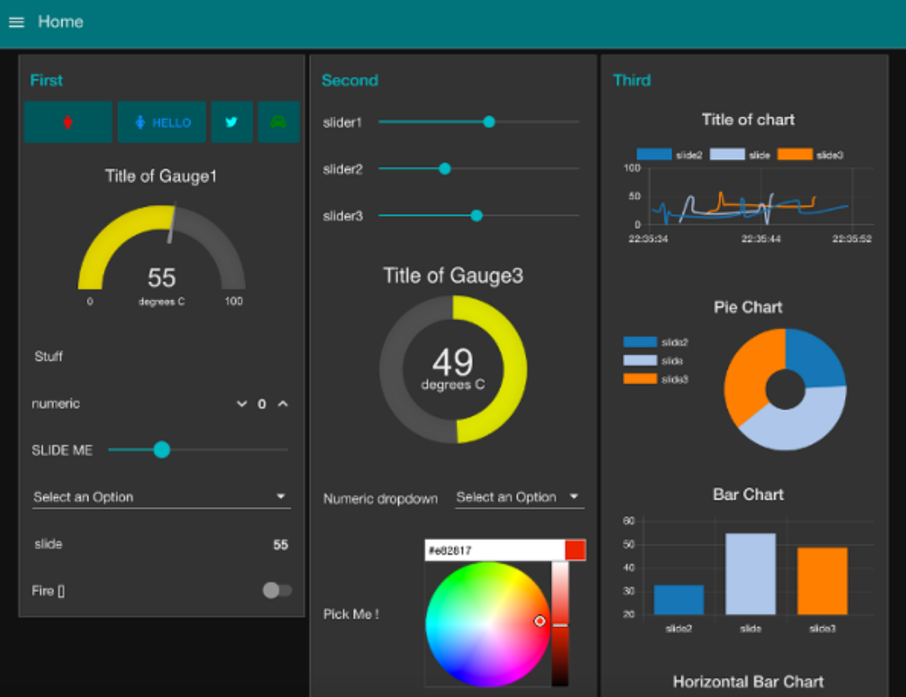

# Node-RED UI and Dashboard Techniques

## Introduction

Dashboards are incredibly useful in a variety of industries. They provide incredible visual insight into applications functionalities and are a great way to measure metrics, visualize data, get alerted with updates and drill down into important details all in one place. Creating effective dashboards for your API driven applications can get pretty tricky and might require a lot of effort and front-end development knowledge. However, Node-RED’s UI nodes makes it effective and easy for anyone to create informative visualizations and within minutes! 

In this lab we will be walking through various different things you can make using Node-RED dashboards! 

## Lab Instructor : 

Pooja Mistry , IBM Developer Advocate \([@poojamakes](https://twitter.com/poojamakes)\)

### 

