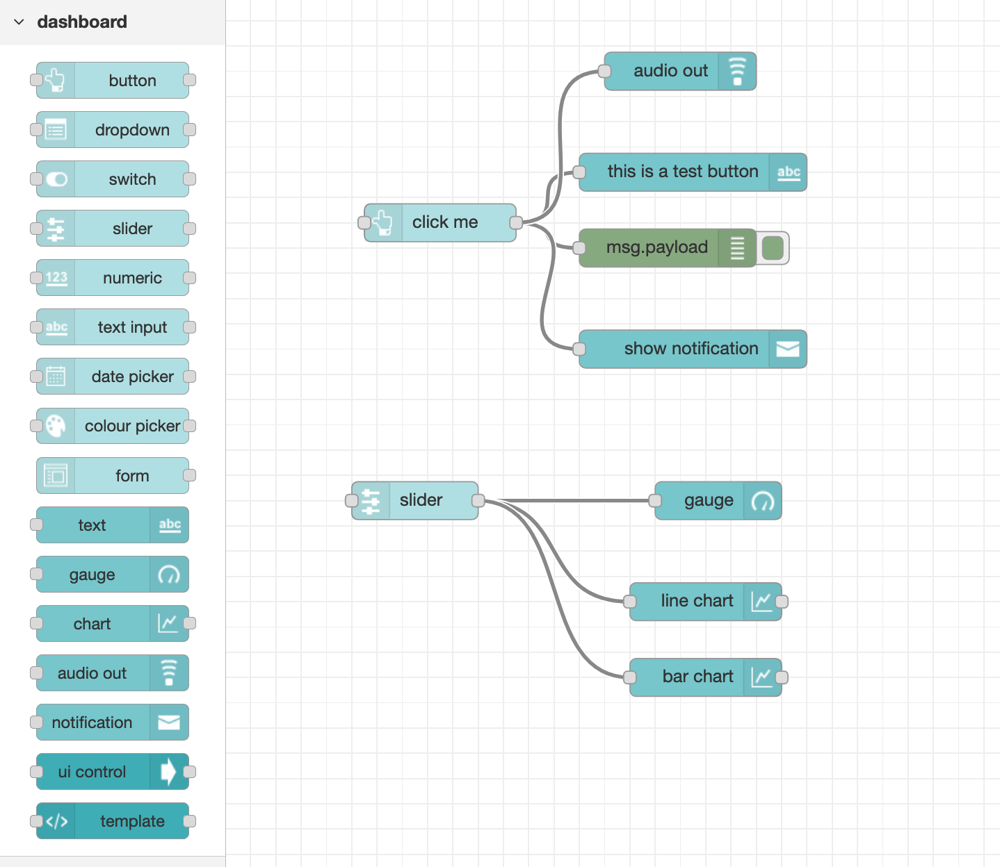
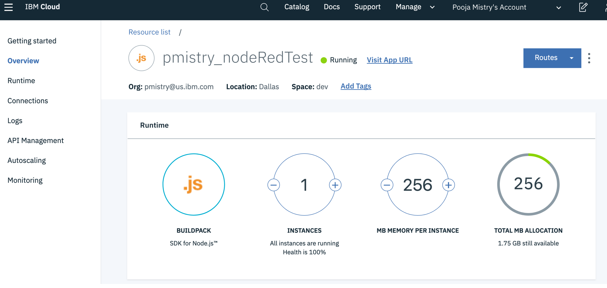
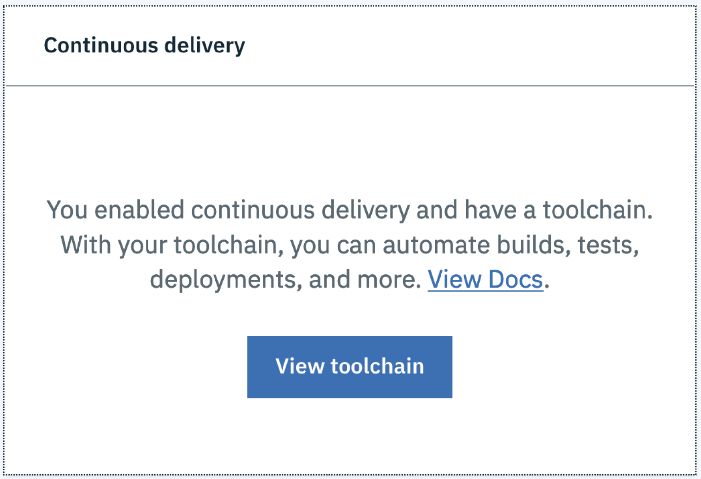
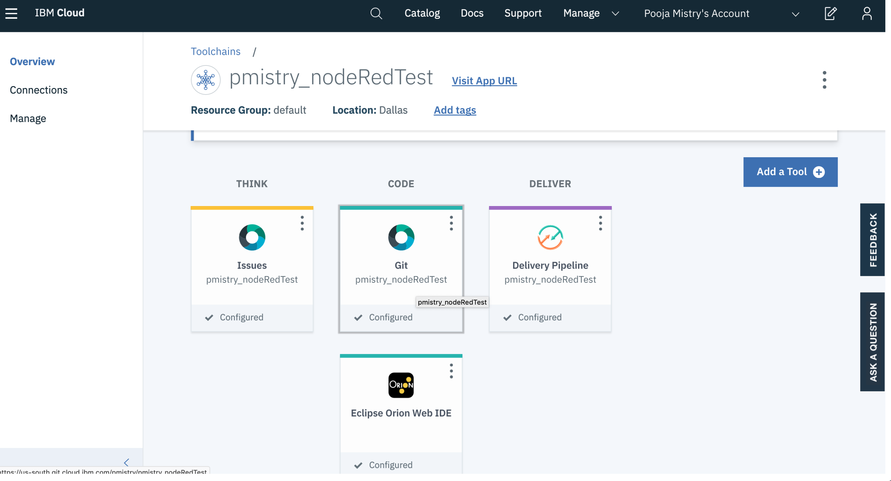
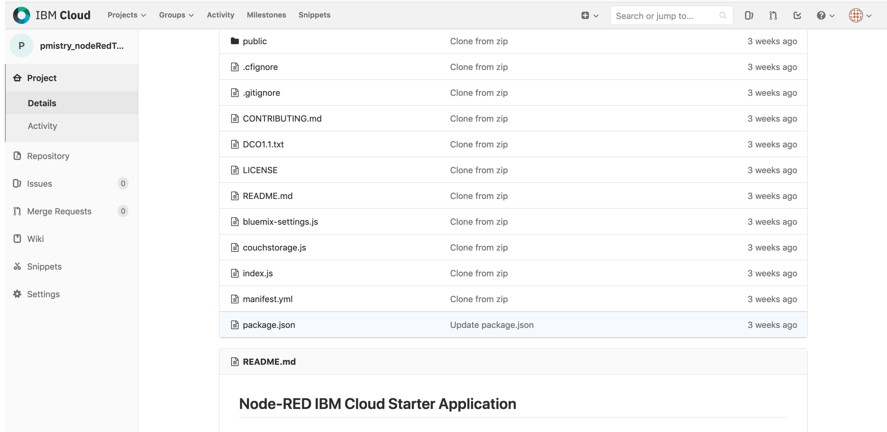
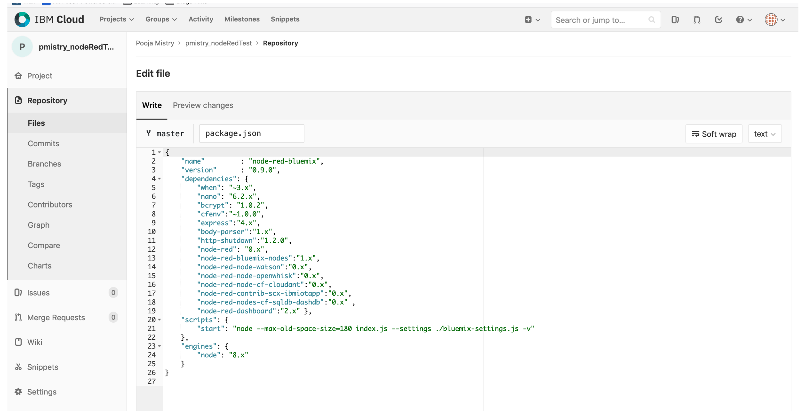
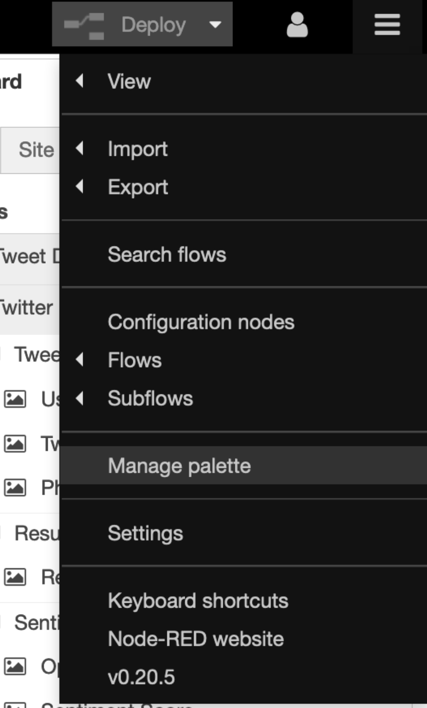
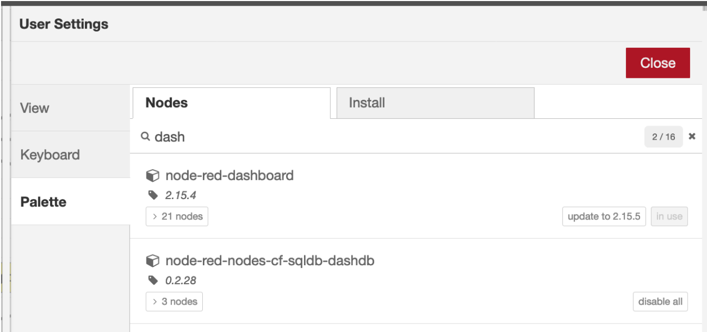

# Installing Dashboards into Node-RED Cloud Instance

## Installing Dashboard Nodes 



**Step 1.** Search for the instance of the Node-RED starter kit you created on IBM Cloud 



**Step 2.** Scroll down to Continuous delivery and click on View toolchain 



**Step 3**.  Click on Git box under Code 



**Step 4** . Once in Git click on package.json 



**Step 5.** Edit package.json dependancies. Add : 

```text
"node-red-dashboard":"2.x" 
```

in the dependency list as so and commit changes 



**Step 6.** Once change is committed, launch the App url once again. Click on the hamburger menu &gt;   Manage Palette section and then search for dashboard nodes. You should see  node-red-dashboard. Click install and you should successfully see dashboard pallet on your Node-RED editor







