# Basic Dashboard Example


## How to build this flow 

### Step 1 .  Drag a Button Node and Configure Groups and Tabs 

Drag a Button node out into the pallet and double click to edit this button's properties 

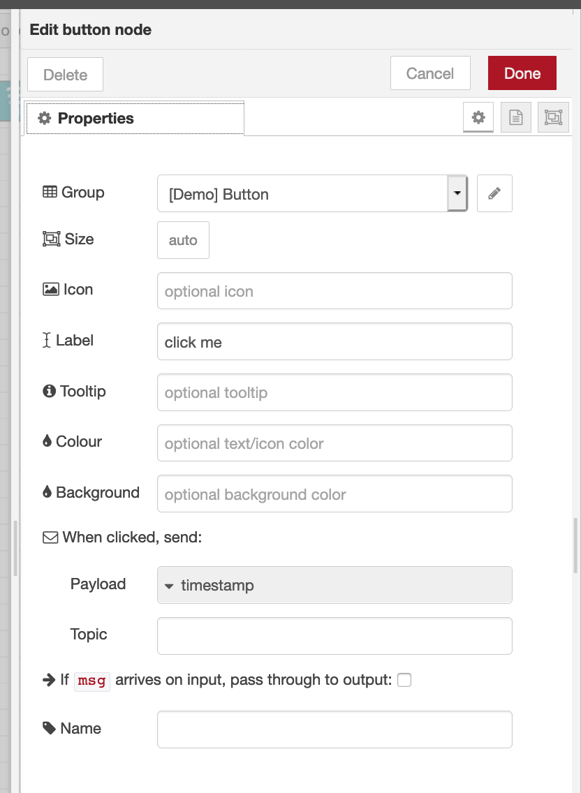

The label describes the button's name and when clicked the button is sending the current time stamp.  Double click on the pencil button next to the group field and indicate the group's name and which tab this field belongs to. In my case I called the tab Demo and the group a button. This tab and group will be used once you add more UI elements to the page. 

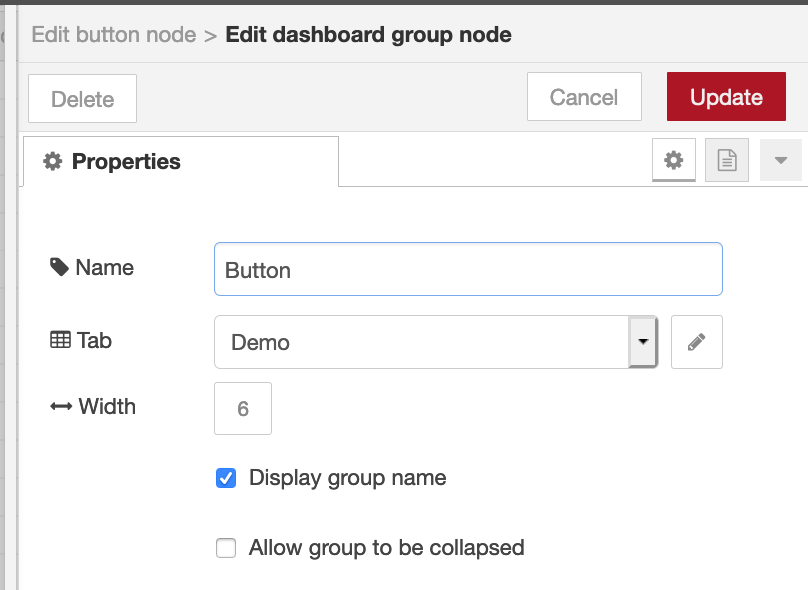

Click update and done when you are done editing this UI element.  You will notice your Tab and group name on the right hand in the layout tab . You can add tabs and groups here as well. 


Connect a debug node to this button node and then deploy.  To see how the dashboard looks like  click on the little square with upward arrow to see the dashboard in another webpage tab. You should see a button and when you click on it you should see current timestamp in your debug console in node -RED .

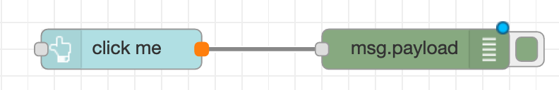

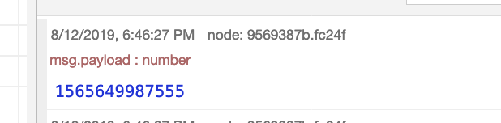

### Step 2. Adding a text box that corresponds to the button 

Drag a Text Node and connect it to output of button node  

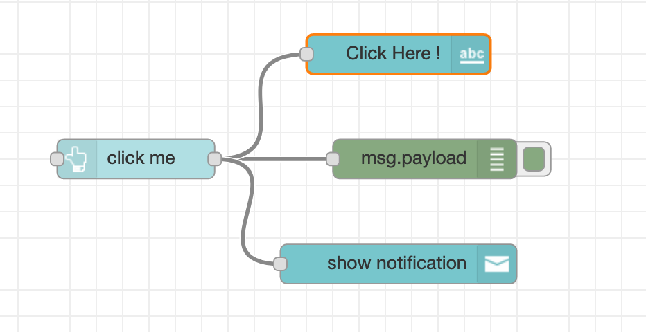

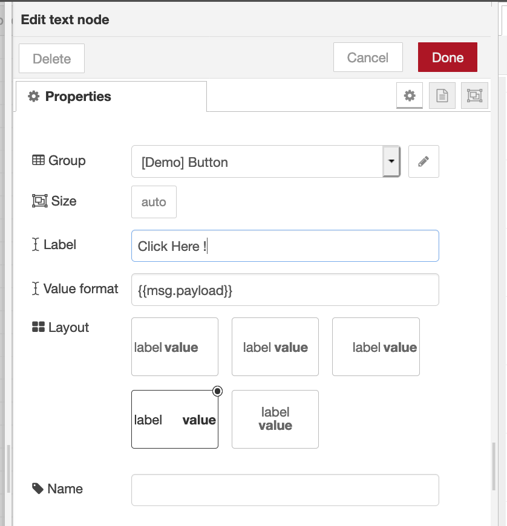

Make sure that the group and tab for the text node are same as the group and tab for the button. This ensures that the text box will correspond to the button UI element . Click deploy and refresh dashboard web page and you should see : 

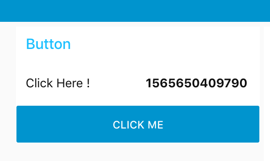

### Step 3. Add an Alert 

Drag a notification node to the workspace and connect it with the output of the button node 

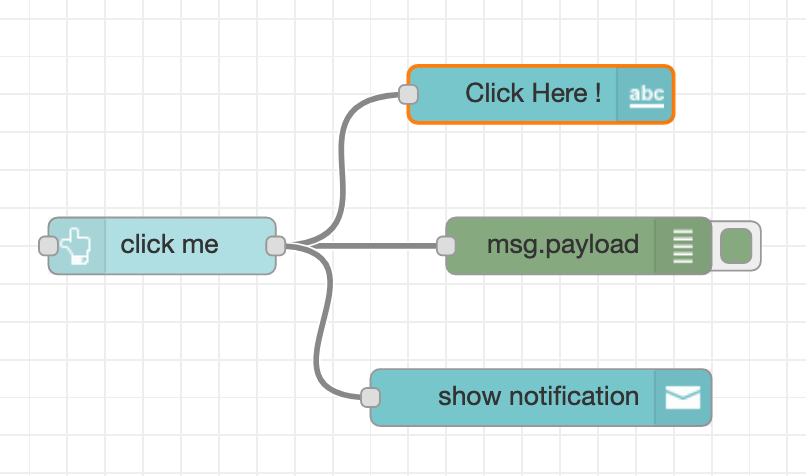

Edit Notification Node's Layout 

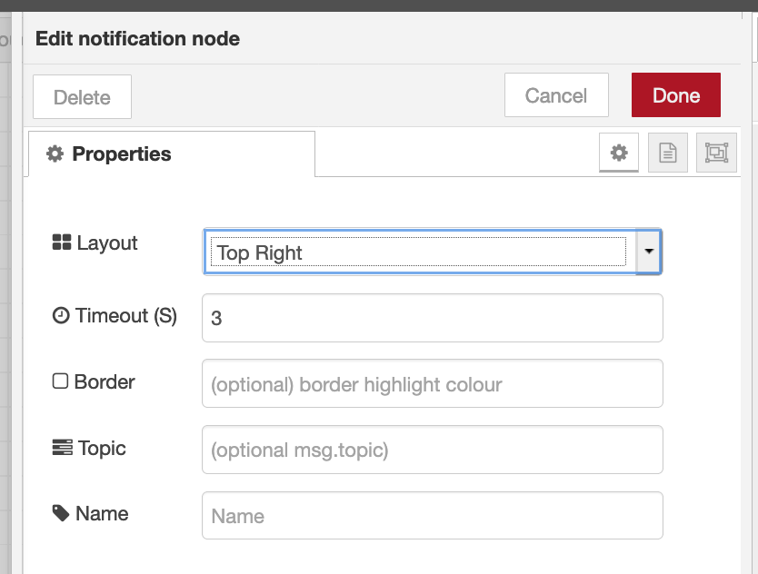

Now once you click the button you should see an alert with the time stamp 

### Step 4. Add Audio Output 

Connect Audio Out  Node to Button Output 

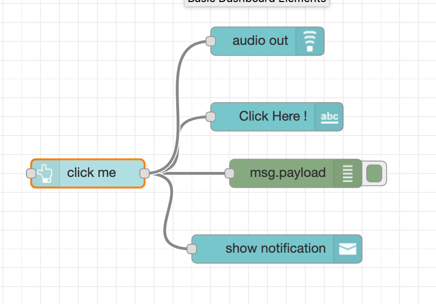

Make sure audio out is the same tag and group as the button element

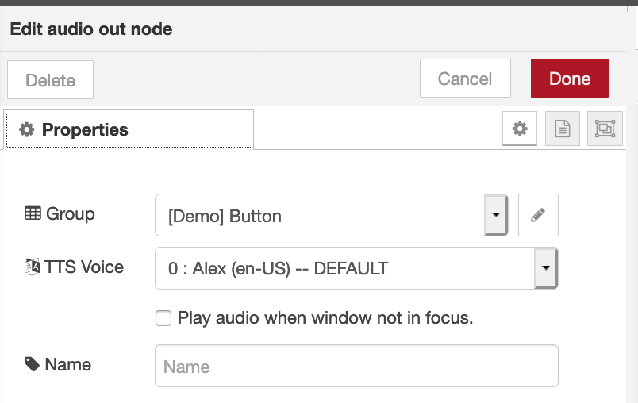

Audio Out only takes text and converts it into audio. So change timestamp input from the button node to string . 


Deploy , and when you click on the button on the dashboard you should hear audio output. 


### Step 5 . Create another group on the same Tab 

This other group will be called Analog and it will be on the same dashboard web page but it will include a slider, a gauge , a line chart and a bar chart ! 

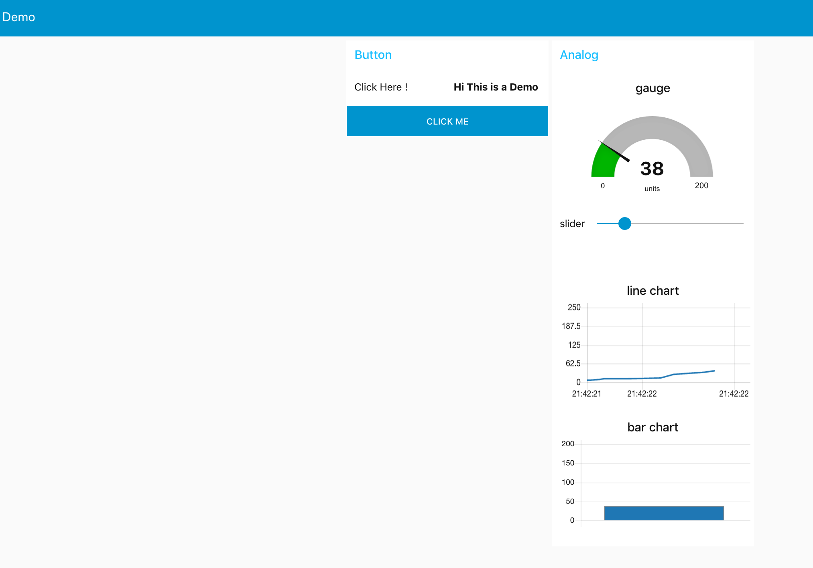


Drag slider node and connect its output to gauge node , chart node \(line\) , and chart node \(bar\). 

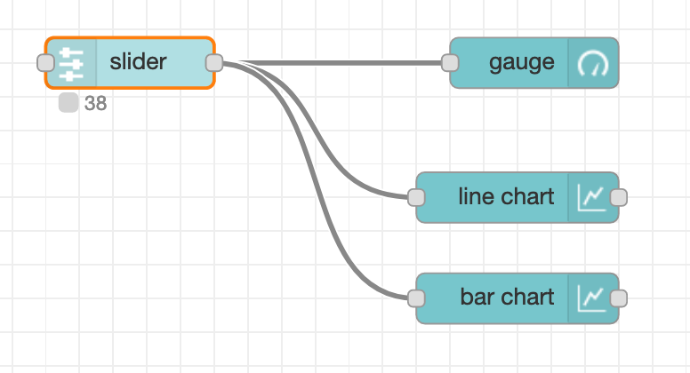

Make sure all nodes are part of Analog group and set range from 0 - 200 

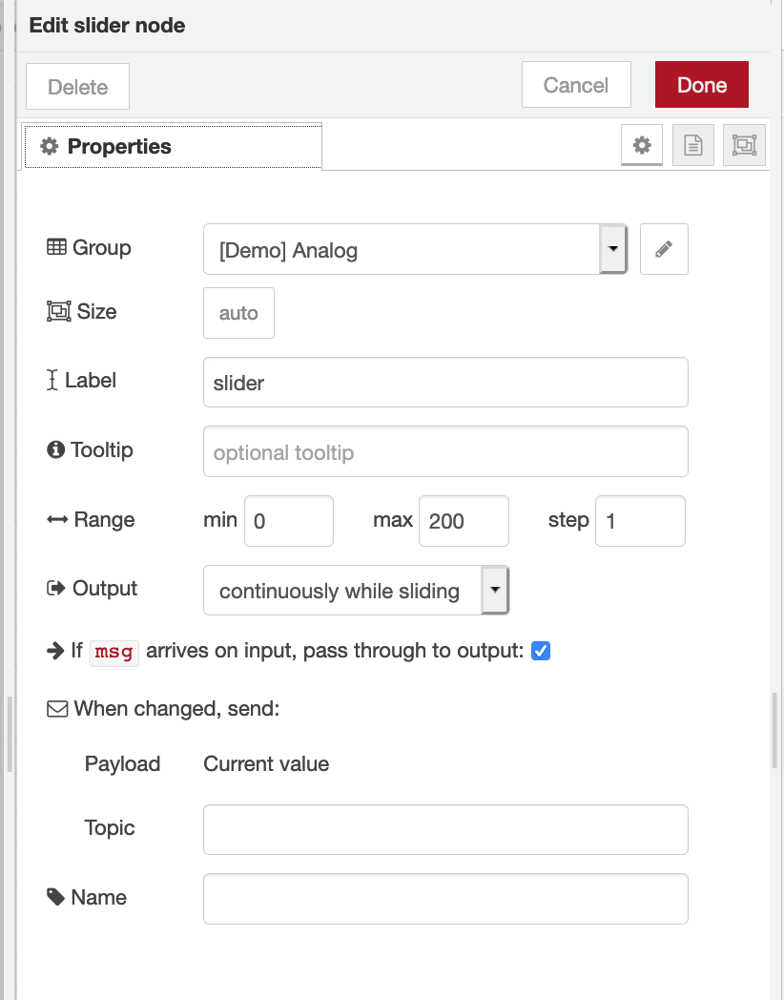

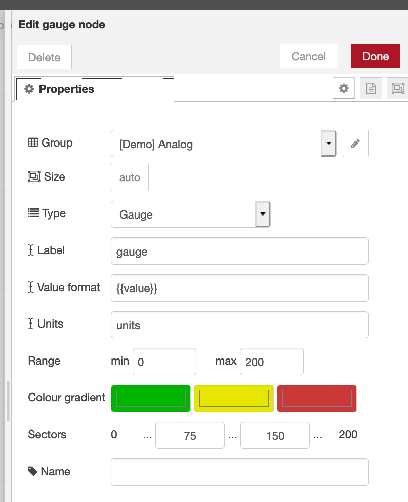


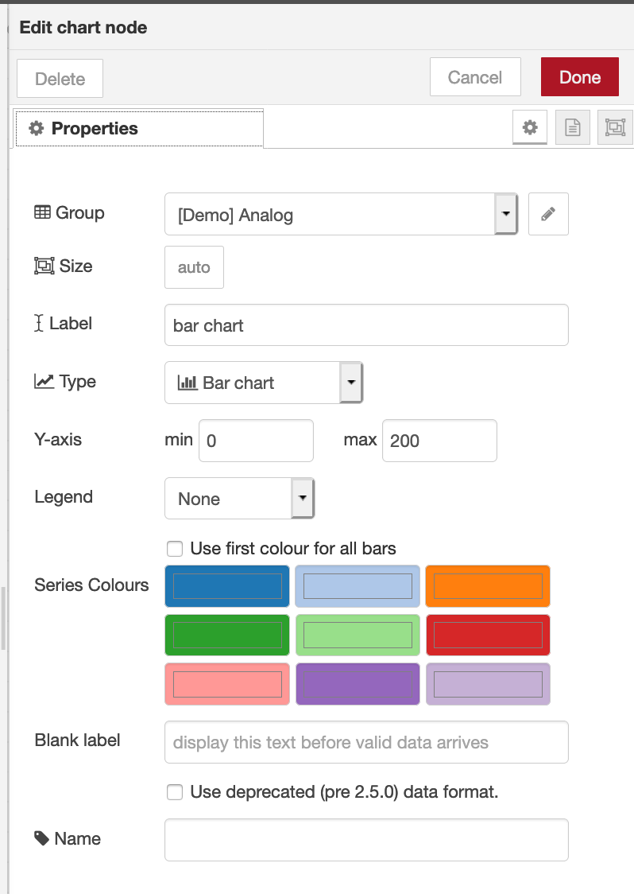

Deploy all changes and open dashboard UI. You should see gauge, line and bar chart fluctuate based on slider input. 

## Import flow from here : 

```text
[{"id":"9583b8de.96bc48","type":"tab","label":"Basic Dashboard Elements","disabled":false,"info":""},{"id":"fd446b54.5da24","type":"ui_button","z":"9583b8de.96bc48","name":"","group":"2fb9c205.dae50e","order":2,"width":0,"height":0,"passthru":false,"label":"click me","tooltip":"","color":"","bgcolor":"","icon":"","payload":"Hi This is a Demo","payloadType":"str","topic":"","x":170,"y":200,"wires":[["9569387b.fc24f","103477f0.45b588","b7e35051.2b75b","3375341f.88f7e4"]]},{"id":"103477f0.45b588","type":"ui_text","z":"9583b8de.96bc48","group":"2fb9c205.dae50e","order":1,"width":0,"height":0,"name":"","label":"Click Here !","format":"","layout":"row-spread","x":370,"y":140,"wires":[]},{"id":"9569387b.fc24f","type":"debug","z":"9583b8de.96bc48","name":"","active":true,"tosidebar":true,"console":false,"tostatus":false,"complete":"payload","targetType":"msg","x":390,"y":200,"wires":[]},{"id":"3692c3e.596783c","type":"ui_gauge","z":"9583b8de.96bc48","name":"","group":"122a9c51.bdf31c","order":1,"width":0,"height":0,"gtype":"gage","title":"gauge","label":"units","format":"","min":0,"max":"200","colors":["#00b500","#e6e600","#ca3838"],"seg1":"75","seg2":"150","x":390,"y":420,"wires":[]},{"id":"b5c97926.f8f0e","type":"ui_slider","z":"9583b8de.96bc48","name":"","label":"slider","tooltip":"","group":"122a9c51.bdf31c","order":1,"width":0,"height":0,"passthru":true,"outs":"all","topic":"","min":0,"max":"200","step":1,"x":150,"y":420,"wires":[["3692c3e.596783c","be838f3e.6af14","da3a316d.a4e43"]]},{"id":"be838f3e.6af14","type":"ui_chart","z":"9583b8de.96bc48","name":"","group":"122a9c51.bdf31c","order":3,"width":"0","height":"0","label":"line chart","chartType":"line","legend":"false","xformat":"HH:mm:ss","interpolate":"linear","nodata":"","dot":false,"ymin":"0","ymax":"200","removeOlder":"2","removeOlderPoints":"","removeOlderUnit":"60","cutout":0,"useOneColor":false,"colors":["#1f77b4","#aec7e8","#ff7f0e","#2ca02c","#98df8a","#d62728","#ff9896","#9467bd","#c5b0d5"],"useOldStyle":false,"outputs":1,"x":380,"y":500,"wires":[[]]},{"id":"da3a316d.a4e43","type":"ui_chart","z":"9583b8de.96bc48","name":"","group":"122a9c51.bdf31c","order":4,"width":"0","height":"0","label":"bar chart","chartType":"bar","legend":"false","xformat":"HH:mm:ss","interpolate":"linear","nodata":"","dot":false,"ymin":"0","ymax":"200","removeOlder":1,"removeOlderPoints":"","removeOlderUnit":"3600","cutout":0,"useOneColor":false,"colors":["#1f77b4","#aec7e8","#ff7f0e","#2ca02c","#98df8a","#d62728","#ff9896","#9467bd","#c5b0d5"],"useOldStyle":false,"outputs":1,"x":380,"y":560,"wires":[[]]},{"id":"b7e35051.2b75b","type":"ui_toast","z":"9583b8de.96bc48","position":"top right","displayTime":"3","highlight":"","outputs":0,"ok":"OK","cancel":"","topic":"","name":"","x":370,"y":280,"wires":[]},{"id":"3375341f.88f7e4","type":"ui_audio","z":"9583b8de.96bc48","name":"","group":"2fb9c205.dae50e","voice":"en-US","always":"","x":360,"y":60,"wires":[]},{"id":"2fb9c205.dae50e","type":"ui_group","z":"","name":"Button","tab":"de296677.584f4","order":1,"disp":true,"width":"6","collapse":false},{"id":"122a9c51.bdf31c","type":"ui_group","z":"","name":"Analog","tab":"de296677.584f4","order":2,"disp":true,"width":"6","collapse":false},{"id":"de296677.584f4","type":"ui_tab","z":"","name":"Demo","icon":"dashboard","order":3,"disabled":false,"hidden":false}]
```

