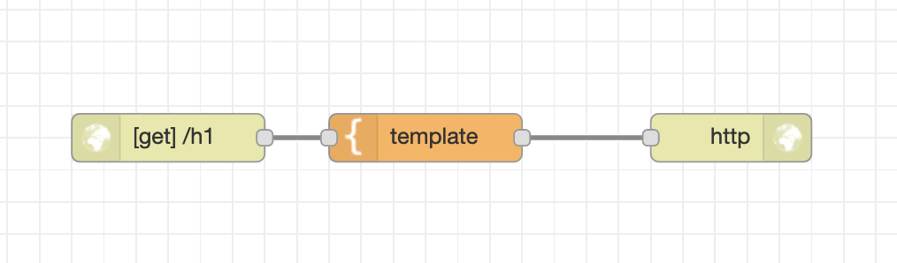
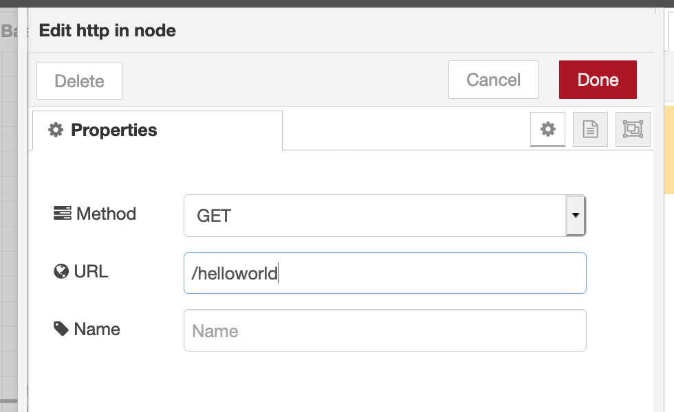
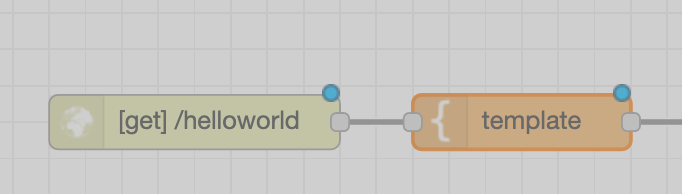
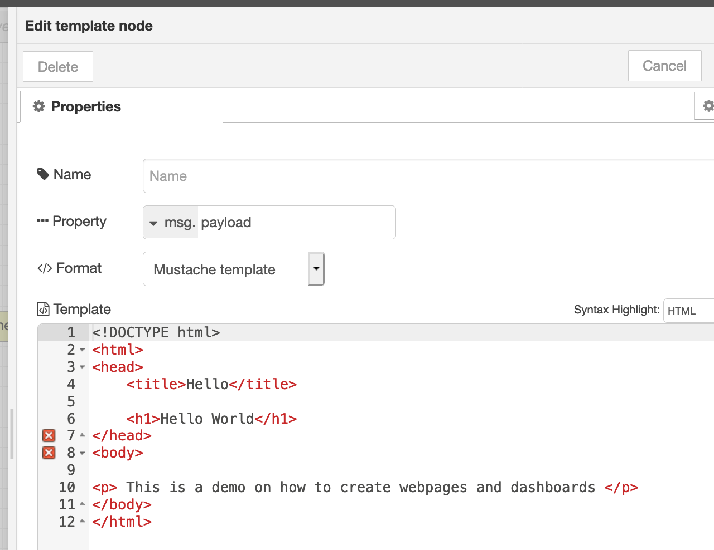
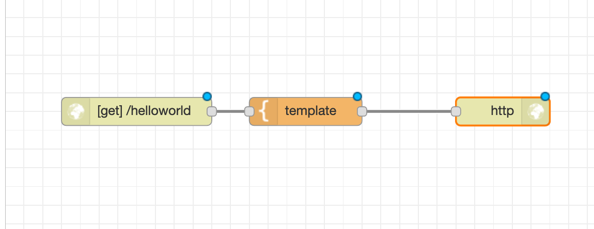

# Basic Web Page

To create a UI with out the use of dashboards, you can use http endpoint nodes. In this example we will walk through a very basic example on how to build a flow using http endpoint



## How to build this flow 

### Step 1 : Drag Http Input Node 

Drag http input node from the input pallet and add a get endpoint url path . This will be the endpoint that you can go to to reach your webpage  




### Step 2 : Drag a template node and connect it to a get http input node 



Drag a template node and add some basic HTML to see html on web page in the template properites 



```text
<!DOCTYPE html>
<html>
<head>
	<title>Hello</title>

	<h1>Hello World</h1>
</head>
<body>

<p> This is a demo on how to create webpages and dashboards </p>
</body>
</html>
```

### Step 3 . Connect the Template node to the http output node and deploy 



your flow should look like this and once you deploy you should be able to access your web page by going  going to your application’s URL and appending  with your endpoint \( in my case : [https://pmistrynoderedtest.mybluemix.net/helloworld](https://pmistrynoderedtest.mybluemix.net/helloworld) \) 

Congrats! You can send your application’s URL to your friends and family and say you created a webpage . Pretty simple, huh? You can create a pretty dynamic web page by adding javascript and css to make your web page more interacterive ! 

In the next section I will show you how to create UIs without any html, css or JS. Just pure node-RED pallet Nodes! 


## Import this flow from here 

```text
[{"id":"790250a5.c8101","type":"tab","label":"Basic Web Page","disabled":false,"info":""},{"id":"473c5d1e.3f773c","type":"http in","z":"790250a5.c8101","name":"","url":"/helloworld","method":"get","upload":false,"swaggerDoc":"","x":140,"y":280,"wires":[["57d73f0b.fd0e78"]]},{"id":"57d73f0b.fd0e78","type":"template","z":"790250a5.c8101","name":"","field":"payload","fieldType":"msg","format":"html","syntax":"mustache","template":"<!DOCTYPE html>\n<html>\n<head>\n\t<title>Hello</title>\n\n\t<h1>Hello World</h1>\n</head>\n<body>\n\n<p> This is a demo on how to create webpages and dashboards </p>\n</body>\n</html>","output":"str","x":320,"y":280,"wires":[["44786f9d.5edfb8"]]},{"id":"44786f9d.5edfb8","type":"http response","z":"790250a5.c8101","name":"","statusCode":"","headers":{},"x":530,"y":280,"wires":[]}]
```

