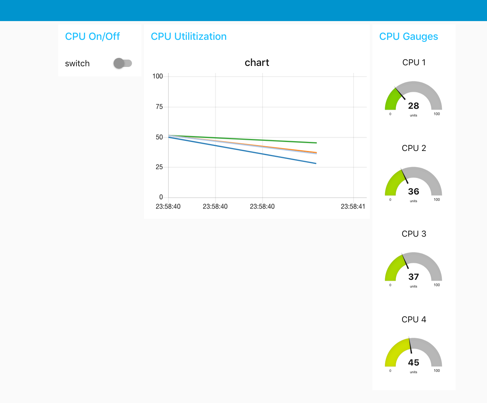
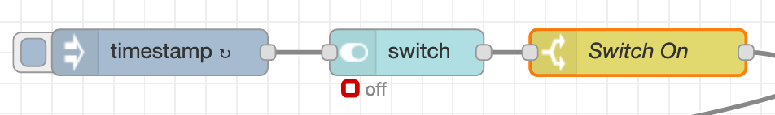
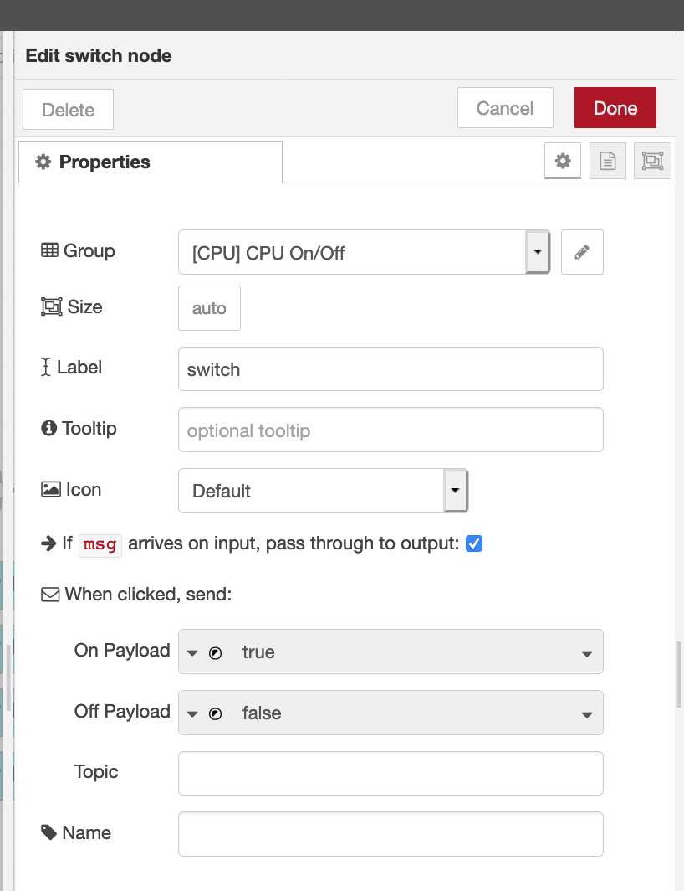
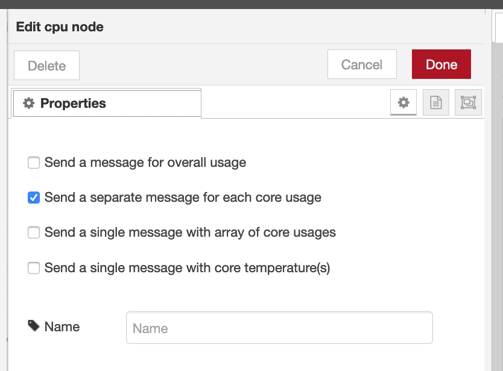
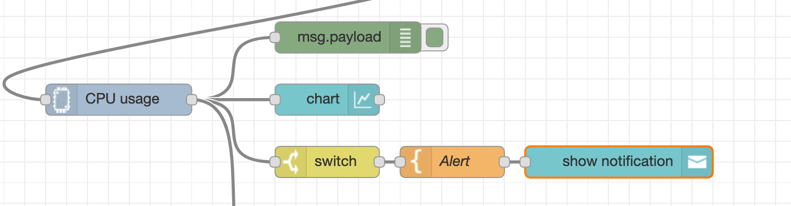
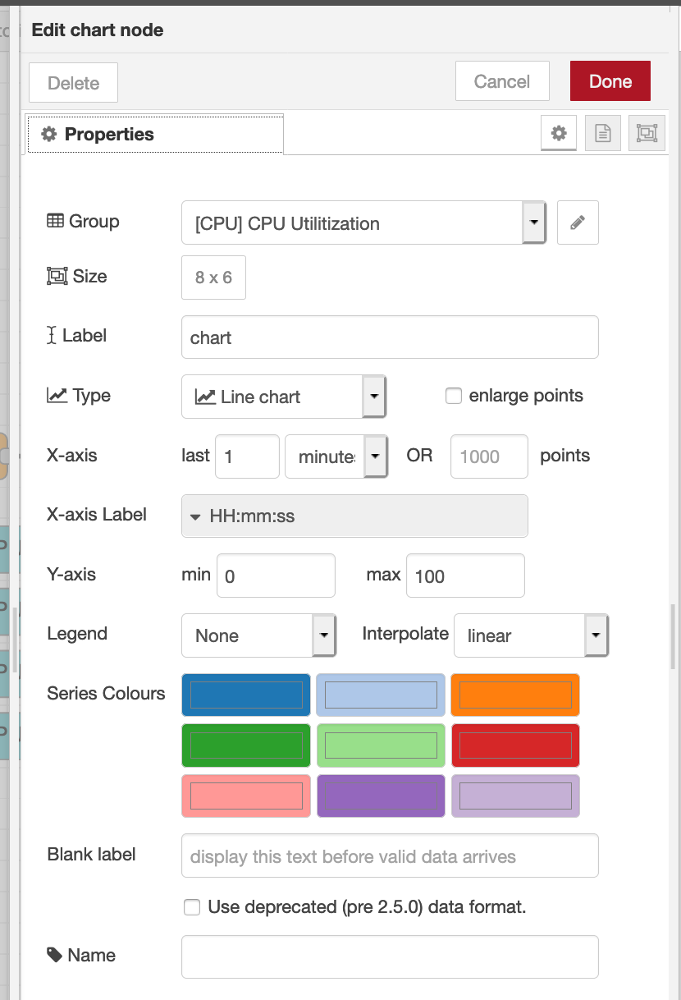
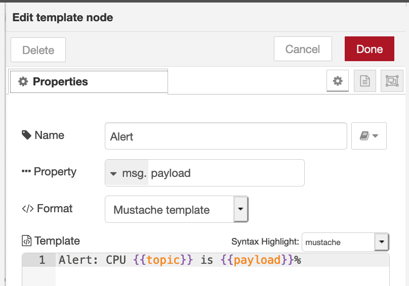
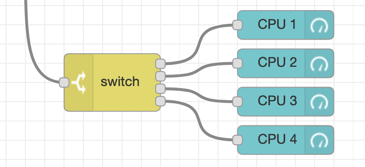
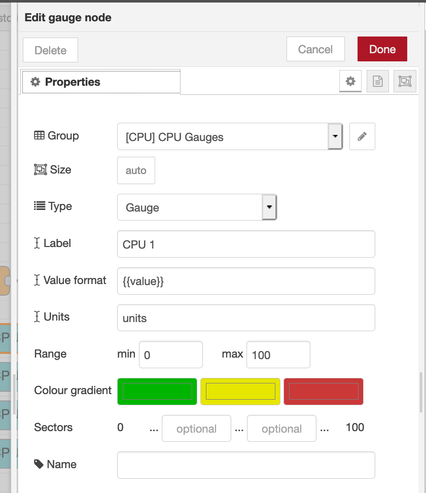
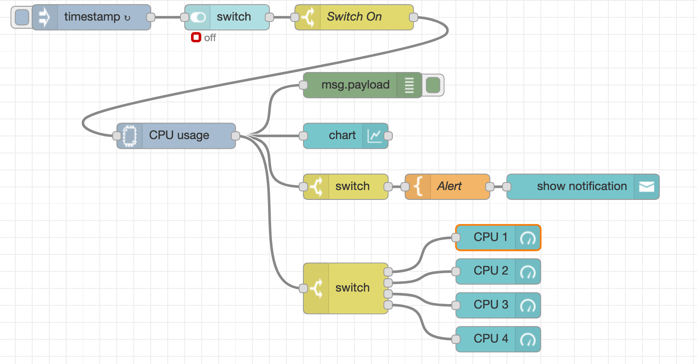

# CPU Dashboards Example



## How to build this flow :

### Step 1. Connect timestamp input to dashboard switch node 



Drag input node and set input properties to send time stamps. Connect input node to switch dashboard node. Create a new tab and group for dashboard node. This way all dashboards can be found in a hamburger menu all in one web page. 



Connect switch dashboard node to switch function node and set msg.payload  is true in switch properties to indicate on switch 

### Step 2. Install CPU usage node 

Go to manage palette and install  `node-red-contrib-cpu` 

Once installed drag CPU node and set property to : 



Connect CPU node to debug node to see message for each core usage on debug panel. Connect CPU node output to chart dashboard to chart a line graph of messages from CPU. Connect a switch node and a notificiation node to alert when messages for CPU cores are greater than 50% 



For chart node make sure to create a new group under CPU tab 



Use a template node between a switch node and alert node to create a template for the message you want to alert : 



### Step 3. Create a gauge for each core 



Use switch node to seperate data coming from all 4 cores. Create seperate guages to map for each core's data. 



Make sure you create a separate group for the gauges . In my case the Tab is still CPU but the group is CPU guages . In the end the dashboard is all under one tab - CPU and there are 3 separate groups - CPU on and off , CPU utilization and CPU gauges . 

Flow should look like this : 



Deploy all changes and see dashboard . When switch is turned on , you should see 4 lines on the utilization chart , as well as different values coming in from each gauge. You should see alerts when values are greater than 50. 


## Import flow from here :

```text
[{"id":"90da6d14.cc65d8","type":"tab","label":"CPU Dashboard","disabled":false,"info":""},{"id":"1e9d7bc0.fcb984","type":"debug","z":"90da6d14.cc65d8","name":"","active":true,"tosidebar":true,"console":false,"tostatus":false,"complete":"payload","targetType":"msg","x":430,"y":140,"wires":[]},{"id":"d274050d.badb88","type":"ui_chart","z":"90da6d14.cc65d8","name":"","group":"baa4830e.d51ff","order":0,"width":"8","height":"6","label":"chart","chartType":"line","legend":"false","xformat":"HH:mm:ss","interpolate":"linear","nodata":"","dot":false,"ymin":"0","ymax":"100","removeOlder":"1","removeOlderPoints":"","removeOlderUnit":"60","cutout":0,"useOneColor":false,"colors":["#1f77b4","#aec7e8","#ff7f0e","#2ca02c","#98df8a","#d62728","#ff9896","#9467bd","#c5b0d5"],"useOldStyle":false,"outputs":1,"x":410,"y":200,"wires":[[]]},{"id":"968d0d83.26b41","type":"inject","z":"90da6d14.cc65d8","name":"","topic":"","payload":"","payloadType":"date","repeat":"1","crontab":"","once":false,"onceDelay":"","x":110,"y":60,"wires":[["4b6874aa.19c8d4"]]},{"id":"4b6874aa.19c8d4","type":"ui_switch","z":"90da6d14.cc65d8","name":"","label":"switch","tooltip":"","group":"6d02446b.841c64","order":0,"width":0,"height":0,"passthru":true,"decouple":"false","topic":"","style":"","onvalue":"true","onvalueType":"bool","onicon":"","oncolor":"","offvalue":"false","offvalueType":"bool","officon":"","offcolor":"","x":270,"y":60,"wires":[["7697565f.2e6618"]]},{"id":"7697565f.2e6618","type":"switch","z":"90da6d14.cc65d8","name":"Switch On","property":"payload","propertyType":"msg","rules":[{"t":"true"}],"checkall":"true","repair":false,"outputs":1,"x":420,"y":60,"wires":[["ed89ea38.72527"]]},{"id":"f12ff5fc.0fc79","type":"ui_toast","z":"90da6d14.cc65d8","position":"top right","displayTime":"3","highlight":"","outputs":0,"ok":"OK","cancel":"","topic":"","name":"","x":690,"y":260,"wires":[]},{"id":"2b2616b0.28443a","type":"template","z":"90da6d14.cc65d8","name":"Alert","field":"payload","fieldType":"msg","format":"handlebars","syntax":"mustache","template":"Alert: CPU {{topic}} is {{payload}}%","output":"str","x":530,"y":260,"wires":[["f12ff5fc.0fc79"]]},{"id":"3af072a3.14a1ce","type":"switch","z":"90da6d14.cc65d8","name":"","property":"payload","propertyType":"msg","rules":[{"t":"gt","v":"50","vt":"num"}],"checkall":"true","repair":false,"outputs":1,"x":410,"y":260,"wires":[["2b2616b0.28443a"]]},{"id":"36c7bd83.27b4f2","type":"ui_gauge","z":"90da6d14.cc65d8","name":"","group":"3d630fa8.8d0d68","order":0,"width":"0","height":"0","gtype":"gage","title":"CPU 1","label":"units","format":"{{value}}","min":0,"max":"100","colors":["#00b500","#e6e600","#ca3838"],"seg1":"","seg2":"","x":590,"y":320,"wires":[]},{"id":"29073f22.c591c8","type":"switch","z":"90da6d14.cc65d8","name":"","property":"topic","propertyType":"msg","rules":[{"t":"eq","v":"core_1","vt":"str"},{"t":"eq","v":"core_2","vt":"str"},{"t":"eq","v":"core_3","vt":"str"},{"t":"eq","v":"core_4","vt":"str"}],"checkall":"true","repair":false,"outputs":4,"x":410,"y":380,"wires":[["36c7bd83.27b4f2"],["b3ee09cd.598f48"],["1ab8d355.16ca75"],["8bd46bad.a915f"]]},{"id":"b3ee09cd.598f48","type":"ui_gauge","z":"90da6d14.cc65d8","name":"","group":"3d630fa8.8d0d68","order":0,"width":0,"height":0,"gtype":"gage","title":"CPU 2","label":"units","format":"{{value}}","min":0,"max":"100","colors":["#00b500","#e6e600","#ca3838"],"seg1":"","seg2":"","x":590,"y":360,"wires":[]},{"id":"1ab8d355.16ca75","type":"ui_gauge","z":"90da6d14.cc65d8","name":"","group":"3d630fa8.8d0d68","order":0,"width":0,"height":0,"gtype":"gage","title":"CPU 3","label":"units","format":"{{value}}","min":0,"max":"100","colors":["#00b500","#e6e600","#ca3838"],"seg1":"","seg2":"","x":590,"y":400,"wires":[]},{"id":"8bd46bad.a915f","type":"ui_gauge","z":"90da6d14.cc65d8","name":"","group":"3d630fa8.8d0d68","order":0,"width":0,"height":0,"gtype":"gage","title":"CPU 4","label":"units","format":"{{value}}","min":0,"max":"100","colors":["#00b500","#e6e600","#ca3838"],"seg1":"","seg2":"","x":590,"y":440,"wires":[]},{"id":"ed89ea38.72527","type":"cpu","z":"90da6d14.cc65d8","name":"","msgCore":true,"msgOverall":false,"msgArray":false,"msgTemp":false,"x":210,"y":200,"wires":[["1e9d7bc0.fcb984","d274050d.badb88","3af072a3.14a1ce","29073f22.c591c8"]]},{"id":"baa4830e.d51ff","type":"ui_group","z":"","name":"CPU Utilitization","tab":"262952a9.f1dcbe","order":2,"disp":true,"width":"8"},{"id":"6d02446b.841c64","type":"ui_group","z":"","name":"CPU On/Off","tab":"262952a9.f1dcbe","order":1,"disp":true,"width":"3"},{"id":"3d630fa8.8d0d68","type":"ui_group","z":"","name":"CPU Gauges","tab":"262952a9.f1dcbe","order":3,"disp":true,"width":"3"},{"id":"262952a9.f1dcbe","type":"ui_tab","z":"","name":"CPU","icon":"dashboard","order":9}]
```

