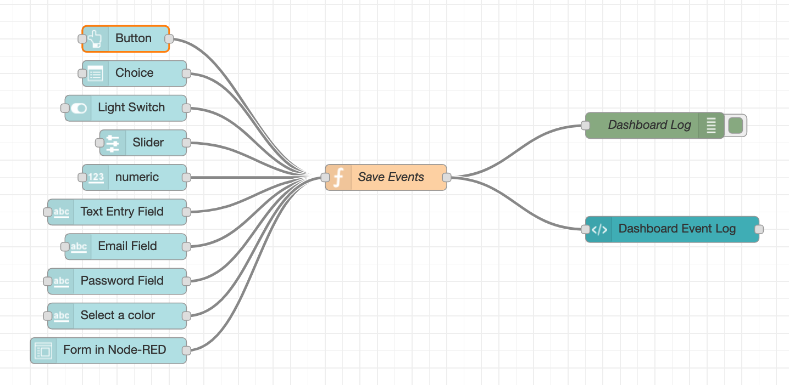

# Forms Example


This example is a simple dashboard that uses many UI elements. Before entering the heart of the matter, let’s see how to use icons. Several icons Open Source libraries can be used to customize the display of the components.

The most well-known are Awesome \([http://fontawesome.io/icons/](http://fontawesome.io/icons/)\). The newer versions are not supported \(4.7 and 5\), but there are many others! To use an Awesome font, add fa – in front of the name of the icon. For example **fa-fire** 




### Import this flow from here : 

```text
[{"id":"4ff48984.4f9cb","type":"tab","label":"Form 2","disabled":false,"info":""},{"id":"60ca4e1f.58d9a8","type":"ui_button","z":"4ff48984.4f9cb","name":"Button","group":"d68e7be3.88f088","order":0,"width":0,"height":0,"passthru":false,"label":"Button","tooltip":"","color":"#fffff","bgcolor":"","icon":"fa-star","payload":"true","payloadType":"bool","topic":"Button","x":150,"y":100,"wires":[["36cff23e.eb790e"]]},{"id":"c5c459e7.f4a85","type":"ui_dropdown","z":"4ff48984.4f9cb","name":"Choice","label":"Choose what you want ","tooltip":"","place":"","group":"d68e7be3.88f088","order":0,"width":0,"height":0,"passthru":true,"options":[{"label":"Choice 1 : String","value":"String","type":"str"},{"label":"Choice 2 : Number","value":4,"type":"num"},{"label":"Choice 3 :Boolean","value":true,"type":"bool"}],"payload":"","topic":"Choice ","x":160,"y":140,"wires":[["36cff23e.eb790e"]]},{"id":"5402bb8a.bff144","type":"debug","z":"4ff48984.4f9cb","name":"Dashboard Log","active":true,"console":"false","complete":"payload","x":760,"y":200,"wires":[]},{"id":"2aa8229.cf9265e","type":"ui_switch","z":"4ff48984.4f9cb","name":"Light Switch","label":"switch","tooltip":"","group":"d68e7be3.88f088","order":0,"width":0,"height":0,"passthru":true,"decouple":"false","topic":"Light Switch ","style":"","onvalue":"true","onvalueType":"bool","onicon":"","oncolor":"","offvalue":"false","offvalueType":"bool","officon":"","offcolor":"","x":150,"y":180,"wires":[["36cff23e.eb790e"]]},{"id":"f559c07a.8ac77","type":"ui_slider","z":"4ff48984.4f9cb","name":"Slider","label":"slider","tooltip":"","group":"d68e7be3.88f088","order":0,"width":0,"height":0,"passthru":true,"outs":"all","topic":"Slider","min":0,"max":10,"step":1,"x":170,"y":220,"wires":[["36cff23e.eb790e"]]},{"id":"4a336fc.fd0001","type":"ui_numeric","z":"4ff48984.4f9cb","name":"","label":"numeric","tooltip":"","group":"d68e7be3.88f088","order":0,"width":0,"height":0,"passthru":true,"topic":"Numérique","format":"{{value}}","min":0,"max":10,"step":"","x":160,"y":260,"wires":[["36cff23e.eb790e"]]},{"id":"dc7a2e3e.65436","type":"ui_text_input","z":"4ff48984.4f9cb","name":"","label":"Text Entry Field ","tooltip":"","group":"d68e7be3.88f088","order":0,"width":0,"height":0,"passthru":true,"mode":"text","delay":"0","topic":"Text Entry Feild","x":140,"y":300,"wires":[["36cff23e.eb790e"]]},{"id":"76836903.e5e028","type":"ui_form","z":"4ff48984.4f9cb","name":"","label":"Form in Node-RED ","group":"54bca71e.4287f","order":0,"width":0,"height":0,"options":[{"label":"Name","value":"Name","type":"text","required":true},{"label":"Number","value":"Number","type":"number","required":false},{"label":"Email","value":"Email","type":"email","required":false},{"label":"Password","value":"Password","type":"password","required":false},{"label":"Check Box","value":"Check Box","type":"checkbox","required":false},{"label":"Light Switch","value":"Light Switch","type":"switch","required":false}],"formValue":{"Name":"","Number":"","Email":"","Password":"","Check Box":false,"Light Switch":false},"payload":"","submit":"Submit","cancel":"Cancle","topic":"Form","x":130,"y":460,"wires":[["36cff23e.eb790e"]]},{"id":"36cff23e.eb790e","type":"function","z":"4ff48984.4f9cb","name":"Save Events","func":"\n// initialise the counter to 0 if it doesn't exist already\nvar dashboardLog = context.get('dashboardLog')|| [];\n\ndashboardLog.push(msg);\nif (dashboardLog.length > 20){\n    // Delete oldest message if > 20\n    dashboardLog.shift();\n    dashboardLog.length = 20;\n} \n\n\n// store the value back\ncontext.set('dashboardLog',dashboardLog);\n\n// make it part of the outgoing msg object\nmsg = {};\nmsg.payload = dashboardLog;\nreturn msg;\n","outputs":1,"noerr":0,"x":450,"y":260,"wires":[["5402bb8a.bff144","4ebedf10.25873"]]},{"id":"4ebedf10.25873","type":"ui_template","z":"4ff48984.4f9cb","group":"6d4b6f37.3f68b","name":"Dashboard Event Log ","order":1,"width":"8","height":"10","format":"<ul>\n <li ng-repeat=\"x in msg.payload\">\n <font color=\"red\">{{x.topic}}</font>\n    <ul>\n        <li>{{x.payload}}</li>\n    </ul>\n </li>\n</ul>","storeOutMessages":true,"fwdInMessages":true,"templateScope":"local","x":780,"y":320,"wires":[[]]},{"id":"f91cf7ee.1cbde8","type":"ui_text_input","z":"4ff48984.4f9cb","name":"","label":"Email Field","tooltip":"","group":"d68e7be3.88f088","order":0,"width":0,"height":0,"passthru":true,"mode":"email","delay":300,"topic":"Email Field","x":150,"y":340,"wires":[["36cff23e.eb790e"]]},{"id":"2fcb4353.31090c","type":"ui_text_input","z":"4ff48984.4f9cb","name":"","label":"Password Field","tooltip":"","group":"d68e7be3.88f088","order":0,"width":0,"height":0,"passthru":true,"mode":"password","delay":300,"topic":"Password ","x":140,"y":380,"wires":[["36cff23e.eb790e"]]},{"id":"5f88c615.20452","type":"ui_text_input","z":"4ff48984.4f9cb","name":"","label":"Select a color","tooltip":"","group":"d68e7be3.88f088","order":0,"width":0,"height":0,"passthru":true,"mode":"color","delay":300,"topic":"Select a color","x":140,"y":420,"wires":[["36cff23e.eb790e"]]},{"id":"d68e7be3.88f088","type":"ui_group","z":"","name":"Forms Example","tab":"67ff17e9.83751","order":1,"disp":true,"width":"8","collapse":false},{"id":"54bca71e.4287f","type":"ui_group","z":"","name":"Form","tab":"67ff17e9.83751","order":2,"disp":true,"width":"8","collapse":false},{"id":"6d4b6f37.3f68b","type":"ui_group","z":"4ff48984.4f9cb","name":"Dashboard Event Log","tab":"67ff17e9.83751","order":3,"disp":true,"width":"8","collapse":false},{"id":"67ff17e9.83751","type":"ui_tab","z":"","name":"Forms Example ","icon":"home","order":2,"disabled":false,"hidden":false}]
```

