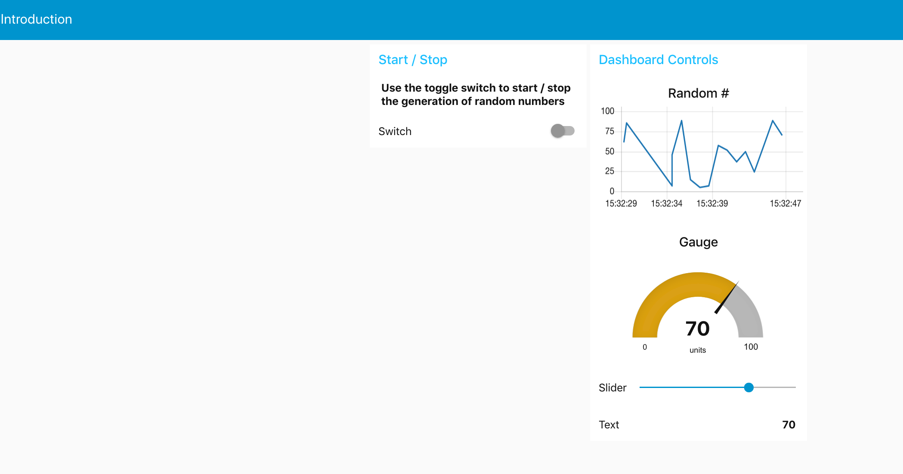
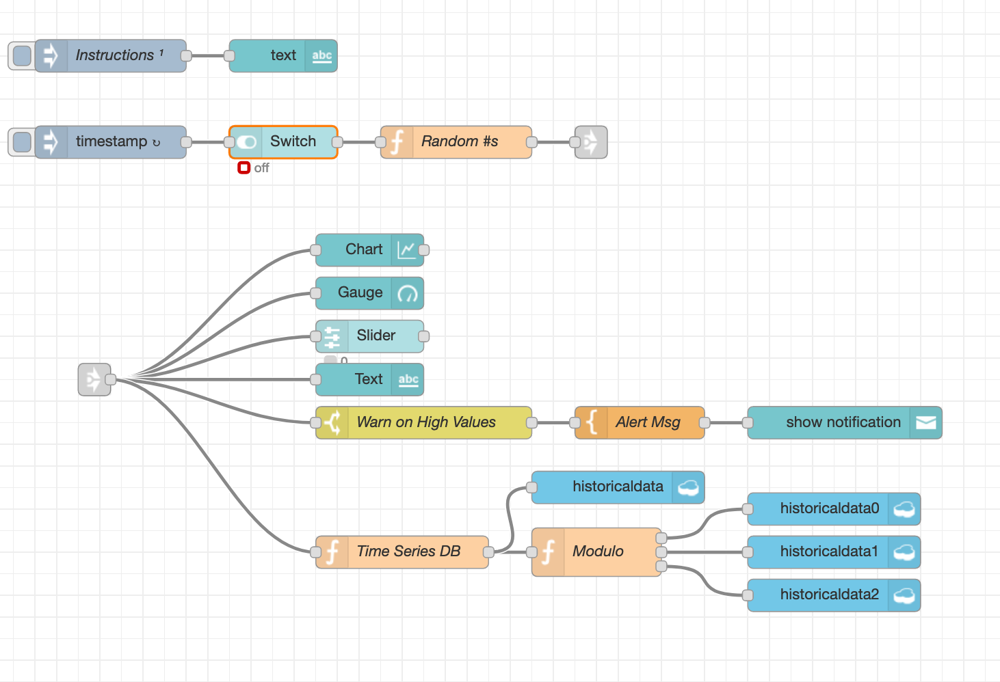
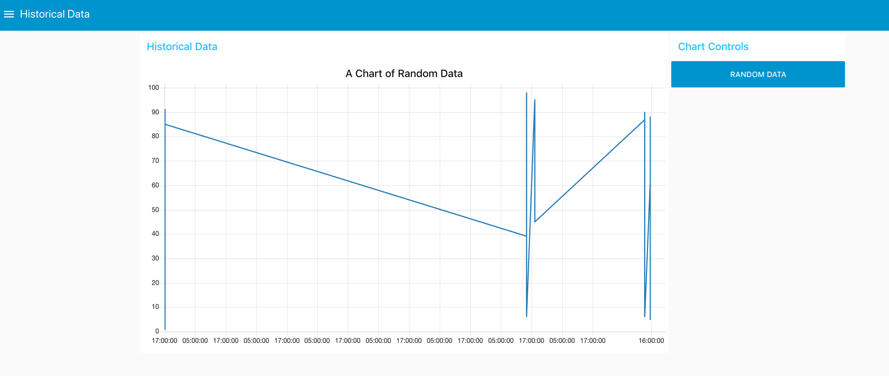
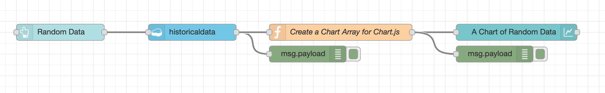

# Historical Data Dashboard Example

### The Introduction Dasboard 



When the switch of this dashboard is turned on and off random data is generated and plotted on the graph. This random data is then stored into various cloudant databases! 



### The Historical Dashboard 



This dashboard is created by taking the data from historical database created in the Introduction dashboard. 



This is the flow that is reading the random data from the historical data table and plotting on historical dashbard 

## Import these flows from here : 

### Introduction Dashboard Flow : 

```text
[{"id":"6cdc3f3d.d9bdd8","type":"tab","label":"Dashboard Intro","disabled":false,"info":""},{"id":"5d36769a.e6cf4","type":"inject","z":"6cdc3f3d.d9bdd8","name":"","topic":"","payload":"","payloadType":"date","repeat":"1","crontab":"","once":false,"onceDelay":"","x":110,"y":140,"wires":[["bbb082fc.9e1988"]]},{"id":"819d8419.7a4e68","type":"function","z":"6cdc3f3d.d9bdd8","name":"Random #s","func":"if( msg.payload === false ) {\n    return null;\n}\nmsg.payload = Math.round(Math.random()*100);\nreturn msg;","outputs":1,"noerr":0,"x":430,"y":140,"wires":[["eff8762c.c62588"]]},{"id":"72358503.9614fc","type":"ui_chart","z":"6cdc3f3d.d9bdd8","name":"Chart","group":"3364ba7.0c020c6","order":0,"width":0,"height":0,"label":"Random #","chartType":"line","legend":"false","xformat":"HH:mm:ss","interpolate":"linear","nodata":"Querying Entropy","dot":false,"ymin":"0","ymax":"100","removeOlder":"1","removeOlderPoints":"","removeOlderUnit":"60","cutout":"","useOneColor":false,"colors":["#1f77b4","#aec7e8","#ff7f0e","#2ca02c","#98df8a","#d62728","#ff9896","#9467bd","#c5b0d5"],"useOldStyle":true,"outputs":1,"x":350,"y":240,"wires":[[]]},{"id":"e00b5147.15ac5","type":"ui_gauge","z":"6cdc3f3d.d9bdd8","name":"Gauge","group":"3364ba7.0c020c6","order":0,"width":0,"height":0,"gtype":"gage","title":"Gauge","label":"units","format":"{{value}}","min":0,"max":"100","colors":["#00b500","#e6e600","#ca3838"],"seg1":"","seg2":"","x":350,"y":280,"wires":[]},{"id":"e8152004.5f00d8","type":"ui_slider","z":"6cdc3f3d.d9bdd8","name":"","label":"Slider","group":"3364ba7.0c020c6","order":0,"width":0,"height":0,"passthru":true,"topic":"","min":0,"max":"100","step":"","x":350,"y":320,"wires":[[]]},{"id":"a41117fb.938838","type":"ui_text","z":"6cdc3f3d.d9bdd8","group":"3364ba7.0c020c6","order":0,"width":0,"height":0,"name":"","label":"Text","format":"{{msg.payload}}","layout":"row-spread","x":350,"y":360,"wires":[]},{"id":"bbb082fc.9e1988","type":"ui_switch","z":"6cdc3f3d.d9bdd8","name":"","label":"Switch","tooltip":"","group":"1153ee5f.3a519a","order":2,"width":0,"height":0,"passthru":true,"decouple":"false","topic":"","style":"","onvalue":"true","onvalueType":"bool","onicon":"","oncolor":"","offvalue":"false","offvalueType":"bool","officon":"","offcolor":"","x":270,"y":140,"wires":[["819d8419.7a4e68"]]},{"id":"142f2189.5c001e","type":"cloudant out","z":"6cdc3f3d.d9bdd8","name":"","cloudant":"","database":"historicaldata0","service":"pmistry_nodeRedTest-cloudantNoSQLDB","payonly":true,"operation":"insert","x":780,"y":480,"wires":[]},{"id":"d92f2cb5.84712","type":"function","z":"6cdc3f3d.d9bdd8","name":"Time Series DB","func":"return {\n    payload: {\n        time: new Date().getTime(),\n        data: msg.payload\n    }\n};","outputs":1,"noerr":0,"x":380,"y":520,"wires":[["fefdde6e.cfb36","25e8d8fd.442f3"]]},{"id":"fefdde6e.cfb36","type":"function","z":"6cdc3f3d.d9bdd8","name":"Modulo","func":"var splitdata =  msg.payload.time % 3;\nif( splitdata === 0 ) {\n    return [msg, null, null];\n} \nelse if( splitdata == 1 ) {\n    return [null, msg, null];\n} \n\nelse if( splitdata == 2) {\n    return [null, null, msg];\n}\nreturn [null, null, null];","outputs":"3","noerr":0,"x":560,"y":520,"wires":[["142f2189.5c001e"],["d1185dfa.e16bd8"],["f7d7635d.8d89a"]]},{"id":"d1185dfa.e16bd8","type":"cloudant out","z":"6cdc3f3d.d9bdd8","name":"","cloudant":"","database":"historicaldata1","service":"pmistry_nodeRedTest-cloudantNoSQLDB","payonly":true,"operation":"insert","x":780,"y":520,"wires":[]},{"id":"f7d7635d.8d89a","type":"cloudant out","z":"6cdc3f3d.d9bdd8","name":"","cloudant":"","database":"historicaldata2","service":"pmistry_nodeRedTest-cloudantNoSQLDB","payonly":true,"operation":"insert","x":780,"y":560,"wires":[]},{"id":"25e8d8fd.442f3","type":"cloudant out","z":"6cdc3f3d.d9bdd8","name":"","cloudant":"","database":"historicaldata","service":"pmistry_nodeRedTest-cloudantNoSQLDB","payonly":true,"operation":"insert","x":580,"y":460,"wires":[]},{"id":"de273cc6.72ece8","type":"ui_text","z":"6cdc3f3d.d9bdd8","group":"1153ee5f.3a519a","order":1,"width":0,"height":0,"name":"","label":"","format":"{{msg.payload}}","layout":"row-spread","x":270,"y":60,"wires":[]},{"id":"36b7dc98.607674","type":"inject","z":"6cdc3f3d.d9bdd8","name":"Instructions","topic":"","payload":"Use the toggle switch to start / stop the generation of random numbers","payloadType":"str","repeat":"","crontab":"","once":true,"x":110,"y":60,"wires":[["de273cc6.72ece8"]]},{"id":"84a5e84f.487ce","type":"ui_toast","z":"6cdc3f3d.d9bdd8","position":"top right","displayTime":"5","highlight":"","outputs":0,"ok":"OK","cancel":"","topic":"","name":"","x":790,"y":400,"wires":[]},{"id":"f77274f8.9d7e48","type":"switch","z":"6cdc3f3d.d9bdd8","name":"Warn on High Values","property":"payload","propertyType":"msg","rules":[{"t":"gt","v":"80","vt":"num"}],"checkall":"true","repair":false,"outputs":1,"x":400,"y":400,"wires":[["59e04d02.276edc"]]},{"id":"59e04d02.276edc","type":"template","z":"6cdc3f3d.d9bdd8","name":"Alert Msg","field":"payload","fieldType":"msg","format":"handlebars","syntax":"mustache","template":"Alert : Critical Value Detected {{payload}}","output":"str","x":600,"y":400,"wires":[["84a5e84f.487ce"]]},{"id":"eff8762c.c62588","type":"link out","z":"6cdc3f3d.d9bdd8","name":"","links":["13ea2af3.d58b6d"],"x":555,"y":140,"wires":[]},{"id":"13ea2af3.d58b6d","type":"link in","z":"6cdc3f3d.d9bdd8","name":"","links":["eff8762c.c62588"],"x":95,"y":360,"wires":[["72358503.9614fc","e00b5147.15ac5","e8152004.5f00d8","a41117fb.938838","f77274f8.9d7e48","d92f2cb5.84712"]]},{"id":"3364ba7.0c020c6","type":"ui_group","z":"6cdc3f3d.d9bdd8","name":"Dashboard Controls","tab":"df1d3372.200e","order":2,"disp":true,"width":"6"},{"id":"1153ee5f.3a519a","type":"ui_group","z":"","name":"Start / Stop","tab":"df1d3372.200e","order":1,"disp":true,"width":"6"},{"id":"df1d3372.200e","type":"ui_tab","z":"6cdc3f3d.d9bdd8","name":"Introduction","icon":"dashboard","order":2}]
```

### Historical Dashboard Flow : 

```text
[{"id":"6cdc3f3d.d9bdd8","type":"tab","label":"Dashboard Intro","disabled":false,"info":""},{"id":"5d36769a.e6cf4","type":"inject","z":"6cdc3f3d.d9bdd8","name":"","topic":"","payload":"","payloadType":"date","repeat":"1","crontab":"","once":false,"onceDelay":"","x":110,"y":140,"wires":[["bbb082fc.9e1988"]]},{"id":"819d8419.7a4e68","type":"function","z":"6cdc3f3d.d9bdd8","name":"Random #s","func":"if( msg.payload === false ) {\n    return null;\n}\nmsg.payload = Math.round(Math.random()*100);\nreturn msg;","outputs":1,"noerr":0,"x":430,"y":140,"wires":[["eff8762c.c62588"]]},{"id":"72358503.9614fc","type":"ui_chart","z":"6cdc3f3d.d9bdd8","name":"Chart","group":"3364ba7.0c020c6","order":0,"width":0,"height":0,"label":"Random #","chartType":"line","legend":"false","xformat":"HH:mm:ss","interpolate":"linear","nodata":"Querying Entropy","dot":false,"ymin":"0","ymax":"100","removeOlder":"1","removeOlderPoints":"","removeOlderUnit":"60","cutout":"","useOneColor":false,"colors":["#1f77b4","#aec7e8","#ff7f0e","#2ca02c","#98df8a","#d62728","#ff9896","#9467bd","#c5b0d5"],"useOldStyle":true,"outputs":1,"x":350,"y":240,"wires":[[]]},{"id":"e00b5147.15ac5","type":"ui_gauge","z":"6cdc3f3d.d9bdd8","name":"Gauge","group":"3364ba7.0c020c6","order":0,"width":0,"height":0,"gtype":"gage","title":"Gauge","label":"units","format":"{{value}}","min":0,"max":"100","colors":["#00b500","#e6e600","#ca3838"],"seg1":"","seg2":"","x":350,"y":280,"wires":[]},{"id":"e8152004.5f00d8","type":"ui_slider","z":"6cdc3f3d.d9bdd8","name":"","label":"Slider","group":"3364ba7.0c020c6","order":0,"width":0,"height":0,"passthru":true,"topic":"","min":0,"max":"100","step":"","x":350,"y":320,"wires":[[]]},{"id":"a41117fb.938838","type":"ui_text","z":"6cdc3f3d.d9bdd8","group":"3364ba7.0c020c6","order":0,"width":0,"height":0,"name":"","label":"Text","format":"{{msg.payload}}","layout":"row-spread","x":350,"y":360,"wires":[]},{"id":"bbb082fc.9e1988","type":"ui_switch","z":"6cdc3f3d.d9bdd8","name":"","label":"Switch","tooltip":"","group":"1153ee5f.3a519a","order":2,"width":0,"height":0,"passthru":true,"decouple":"false","topic":"","style":"","onvalue":"true","onvalueType":"bool","onicon":"","oncolor":"","offvalue":"false","offvalueType":"bool","officon":"","offcolor":"","x":270,"y":140,"wires":[["819d8419.7a4e68"]]},{"id":"142f2189.5c001e","type":"cloudant out","z":"6cdc3f3d.d9bdd8","name":"","cloudant":"","database":"historicaldata0","service":"pmistry_nodeRedTest-cloudantNoSQLDB","payonly":true,"operation":"insert","x":780,"y":480,"wires":[]},{"id":"d92f2cb5.84712","type":"function","z":"6cdc3f3d.d9bdd8","name":"Time Series DB","func":"return {\n    payload: {\n        time: new Date().getTime(),\n        data: msg.payload\n    }\n};","outputs":1,"noerr":0,"x":380,"y":520,"wires":[["fefdde6e.cfb36","25e8d8fd.442f3"]]},{"id":"fefdde6e.cfb36","type":"function","z":"6cdc3f3d.d9bdd8","name":"Modulo","func":"var splitdata =  msg.payload.time % 3;\nif( splitdata === 0 ) {\n    return [msg, null, null];\n} \nelse if( splitdata == 1 ) {\n    return [null, msg, null];\n} \n\nelse if( splitdata == 2) {\n    return [null, null, msg];\n}\nreturn [null, null, null];","outputs":"3","noerr":0,"x":560,"y":520,"wires":[["142f2189.5c001e"],["d1185dfa.e16bd8"],["f7d7635d.8d89a"]]},{"id":"d1185dfa.e16bd8","type":"cloudant out","z":"6cdc3f3d.d9bdd8","name":"","cloudant":"","database":"historicaldata1","service":"pmistry_nodeRedTest-cloudantNoSQLDB","payonly":true,"operation":"insert","x":780,"y":520,"wires":[]},{"id":"f7d7635d.8d89a","type":"cloudant out","z":"6cdc3f3d.d9bdd8","name":"","cloudant":"","database":"historicaldata2","service":"pmistry_nodeRedTest-cloudantNoSQLDB","payonly":true,"operation":"insert","x":780,"y":560,"wires":[]},{"id":"25e8d8fd.442f3","type":"cloudant out","z":"6cdc3f3d.d9bdd8","name":"","cloudant":"","database":"historicaldata","service":"pmistry_nodeRedTest-cloudantNoSQLDB","payonly":true,"operation":"insert","x":580,"y":460,"wires":[]},{"id":"de273cc6.72ece8","type":"ui_text","z":"6cdc3f3d.d9bdd8","group":"1153ee5f.3a519a","order":1,"width":0,"height":0,"name":"","label":"","format":"{{msg.payload}}","layout":"row-spread","x":270,"y":60,"wires":[]},{"id":"36b7dc98.607674","type":"inject","z":"6cdc3f3d.d9bdd8","name":"Instructions","topic":"","payload":"Use the toggle switch to start / stop the generation of random numbers","payloadType":"str","repeat":"","crontab":"","once":true,"x":110,"y":60,"wires":[["de273cc6.72ece8"]]},{"id":"84a5e84f.487ce","type":"ui_toast","z":"6cdc3f3d.d9bdd8","position":"top right","displayTime":"5","highlight":"","outputs":0,"ok":"OK","cancel":"","topic":"","name":"","x":790,"y":400,"wires":[]},{"id":"f77274f8.9d7e48","type":"switch","z":"6cdc3f3d.d9bdd8","name":"Warn on High Values","property":"payload","propertyType":"msg","rules":[{"t":"gt","v":"80","vt":"num"}],"checkall":"true","repair":false,"outputs":1,"x":400,"y":400,"wires":[["59e04d02.276edc"]]},{"id":"59e04d02.276edc","type":"template","z":"6cdc3f3d.d9bdd8","name":"Alert Msg","field":"payload","fieldType":"msg","format":"handlebars","syntax":"mustache","template":"Alert : Critical Value Detected {{payload}}","output":"str","x":600,"y":400,"wires":[["84a5e84f.487ce"]]},{"id":"eff8762c.c62588","type":"link out","z":"6cdc3f3d.d9bdd8","name":"","links":["13ea2af3.d58b6d"],"x":555,"y":140,"wires":[]},{"id":"13ea2af3.d58b6d","type":"link in","z":"6cdc3f3d.d9bdd8","name":"","links":["eff8762c.c62588"],"x":95,"y":360,"wires":[["72358503.9614fc","e00b5147.15ac5","e8152004.5f00d8","a41117fb.938838","f77274f8.9d7e48","d92f2cb5.84712"]]},{"id":"3364ba7.0c020c6","type":"ui_group","z":"6cdc3f3d.d9bdd8","name":"Dashboard Controls","tab":"df1d3372.200e","order":2,"disp":true,"width":"6"},{"id":"1153ee5f.3a519a","type":"ui_group","z":"","name":"Start / Stop","tab":"df1d3372.200e","order":1,"disp":true,"width":"6"},{"id":"df1d3372.200e","type":"ui_tab","z":"6cdc3f3d.d9bdd8","name":"Introduction","icon":"dashboard","order":2}]
```

