# Intro to Cloudant Data Base Example

## The Cloudant Database 

When you create a Node-RED instance using the Node-RED starter kit, you are also creating a Cloudant Database Service. This database allows you to store data that you may want to use while you are building out your flows. 

### How to access the database 

#### Step 1. Go to your Node-RED service on the IBM Cloud 

Go back to IBM Cloud and search for your Node-RED service in the dashboard or in the search bar. 

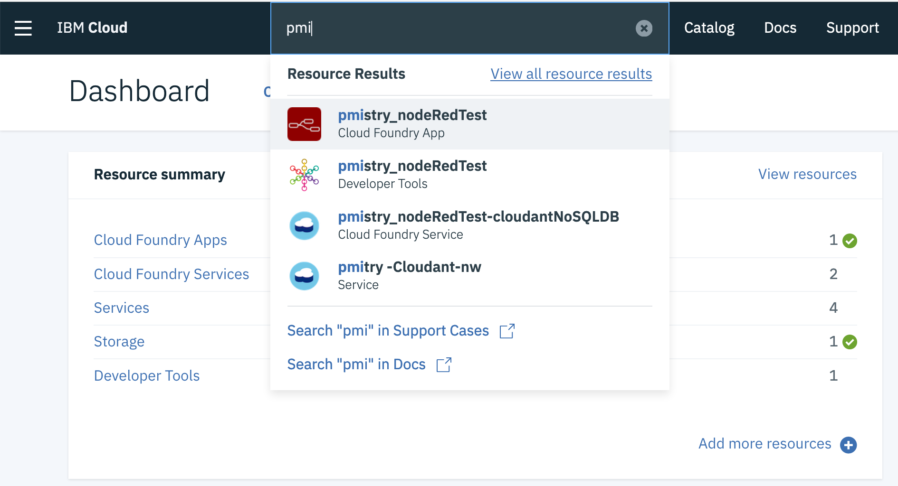

Click on your instance of Node-RED and you should see a cloudantNoSQLDB service in your connection's list 

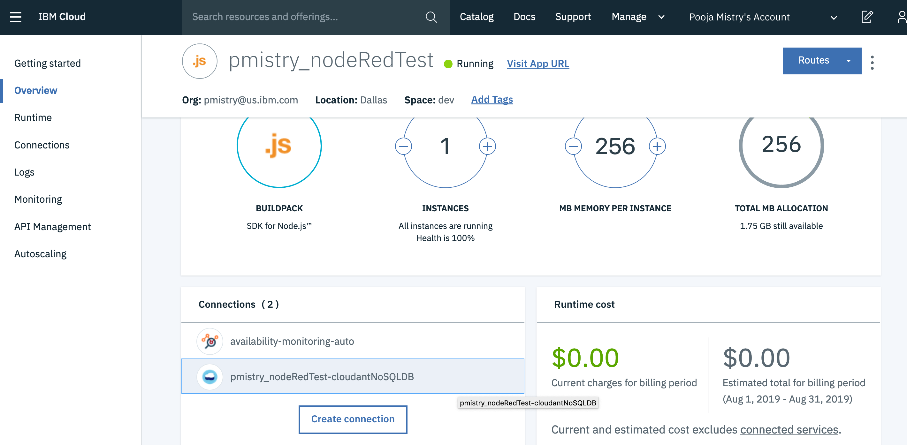

#### Step 2 . Click on your Cloudant Connection 

Click on your Cloudant Connection and it should take you to your connection list 

Click on the Alias of ....  link and that should take you to your Cloudant Service 

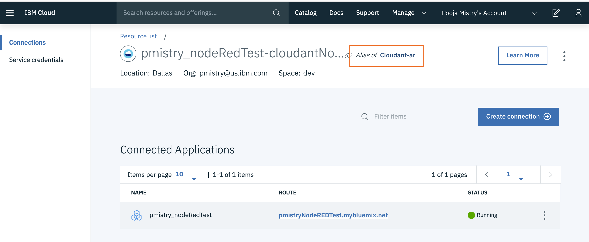

#### Step 3. Go to your Cloudant Dashboard 

Once on your Cloudant account go to Manage and you should be able to see Launch your cloudant dashboard. 

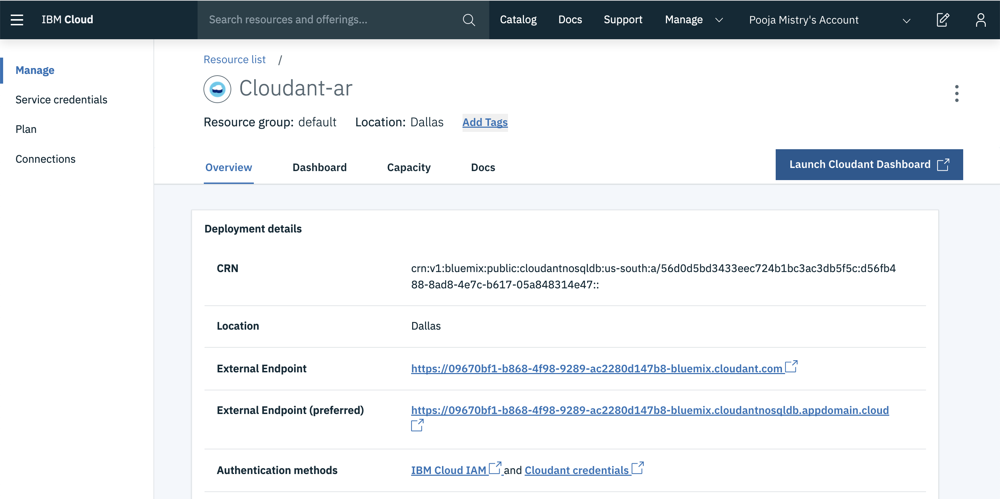

Your Cloudant dashboard should include all the database tables you create in Node-RED 

## Creating a Flow that Reads and Writes to the Cloudant Dashboard 

### Step 1.  Insert a inject node connected to a Cloudant node. This will write data into the database

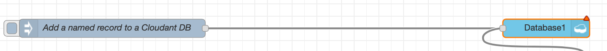

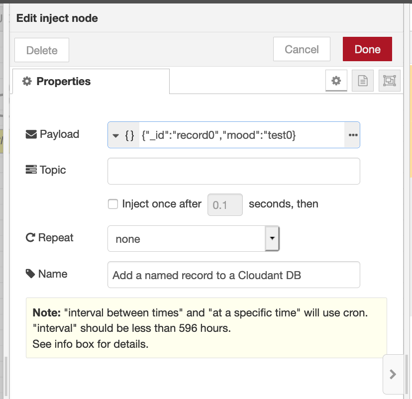

Make sure the inject value is a payload such as: 

```text
{"_id":"record0","mood":"test0}
```

In this payload we are inserting "\_id" and "mood"

In the cloudant data base node,  name your data base and set operation as insert . This way you are inserting value into your db. 

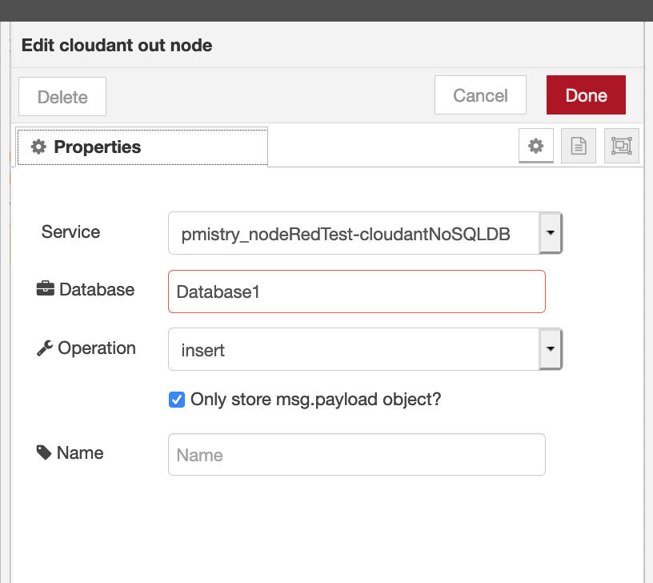

### Step 2 . Insert inject node that Reads "\_id" value from the database as well as changes the "mood" value 


Insert another inject node and connect to the database node to read "\_id" value 

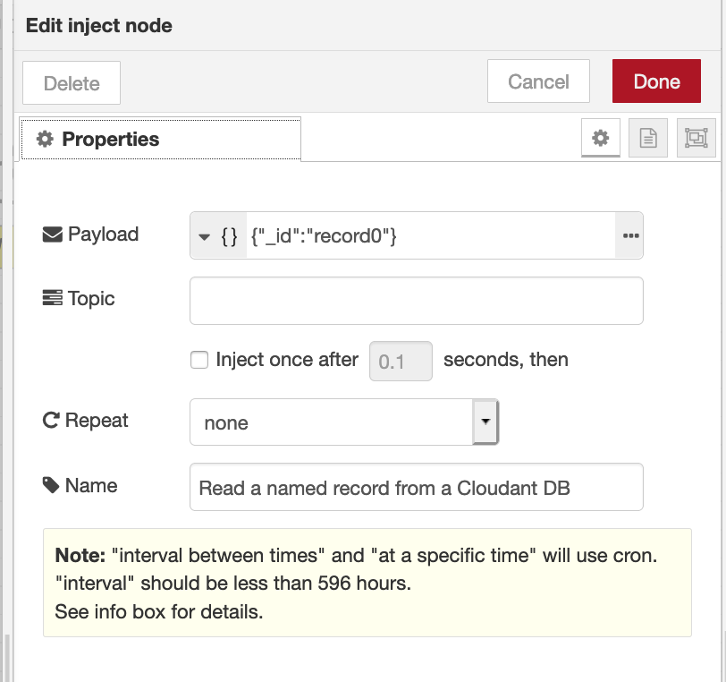

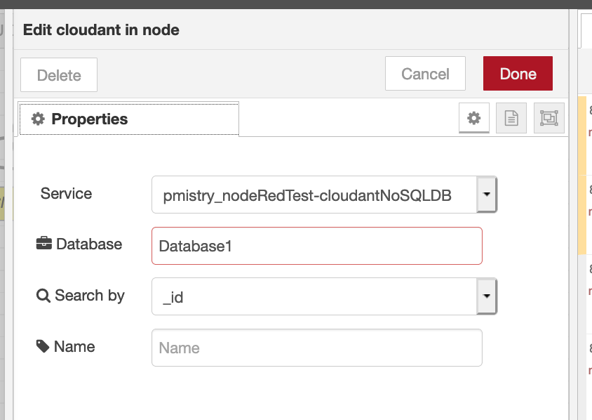

Insert a change node to change value of "mood"  in the data base 

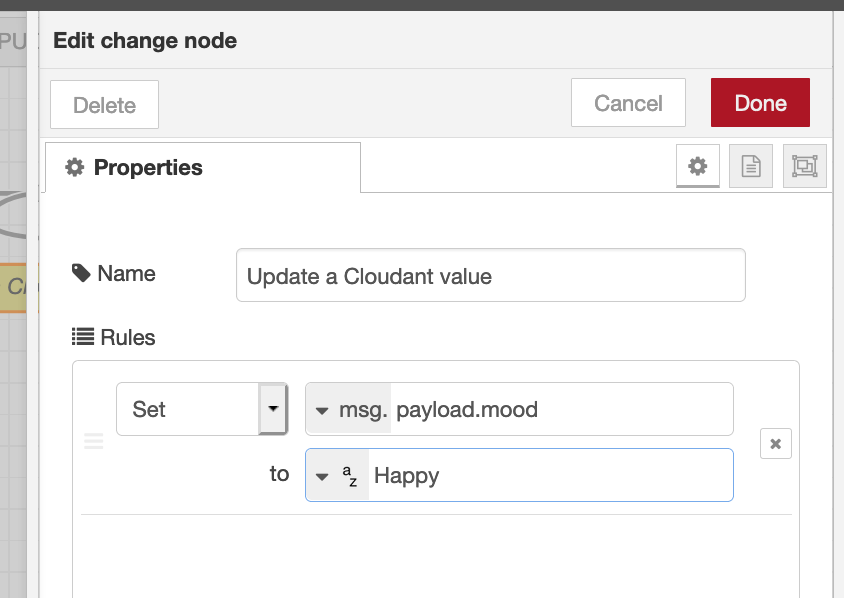

Deploy your flow and in the debug node you should see : 

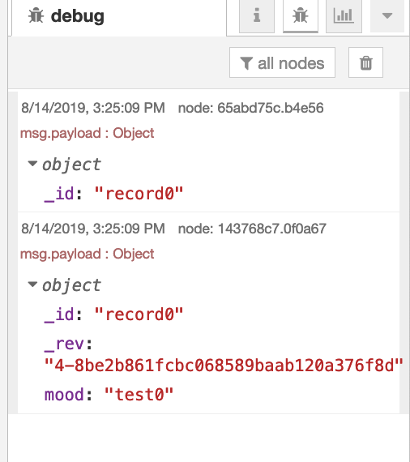

### Step 3. See Changed values in the database 

Go to your Cloudant Database Dashboard and find the database you created

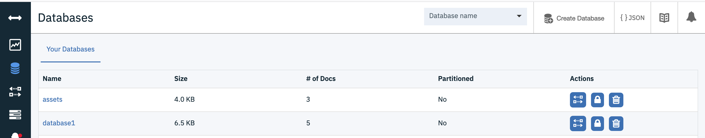

Click on your database and you should see a record of all your data 

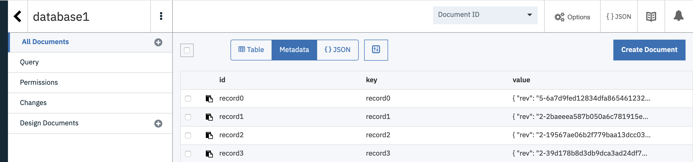

Click on record you recently created in Node-RED to see the changed data Value 

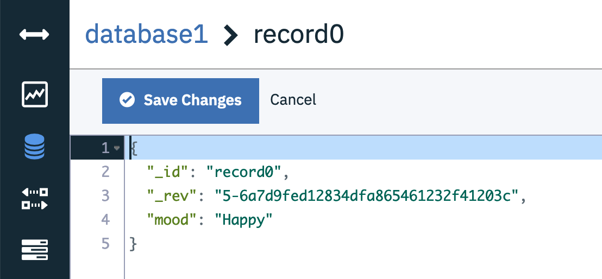

You should successfully be able to see this values you stored and created in the cloudant database! 


## Import this flow from here : 

```text
[{"id":"f29d86a3.e756c","type":"tab","label":"Cloudant","disabled":false,"info":""},{"id":"d2b86d3f.99d94","type":"inject","z":"f29d86a3.e756c","name":"Add a named record to a Cloudant DB","topic":"","payload":"{\"id\":\"record0\",\"mood\":\"test0\"}","payloadType":"json","repeat":"","crontab":"","once":false,"onceDelay":"","x":190,"y":80,"wires":[["634ab55d.88a704"]]},{"id":"634ab55d.88a704","type":"cloudant out","z":"f29d86a3.e756c","name":"","cloudant":"c4e13a43.b53158","database":"Database1","service":"pmistry_nodeRedTest-cloudantNoSQLDB","payonly":true,"operation":"insert","x":890,"y":80,"wires":[]},{"id":"377b5fef.86df78","type":"inject","z":"f29d86a3.e756c","name":"Read a named record from a Cloudant DB","topic":"","payload":"{\"_id\":\"record0\"}","payloadType":"json","repeat":"","crontab":"","once":false,"onceDelay":"","x":200,"y":160,"wires":[["430a41ad.3a91f8","65abd75c.b4e56"]]},{"id":"430a41ad.3a91f8","type":"cloudant in","z":"f29d86a3.e756c","name":"","cloudant":"","database":"Database1","service":"pmistry_nodeRedTest-cloudantNoSQLDB","search":"_id","design":"","index":"","x":490,"y":160,"wires":[["143768c7.0f0a67","fb2bffe4.92ad78"]]},{"id":"143768c7.0f0a67","type":"debug","z":"f29d86a3.e756c","name":"","active":true,"tosidebar":true,"console":false,"tostatus":false,"complete":"payload","targetType":"msg","x":670,"y":260,"wires":[]},{"id":"fb2bffe4.92ad78","type":"change","z":"f29d86a3.e756c","name":"Update a Cloudant value","rules":[{"t":"set","p":"payload.mood","pt":"msg","to":"Happy","tot":"str"}],"action":"","property":"","from":"","to":"","reg":false,"x":810,"y":140,"wires":[["634ab55d.88a704"]]},{"id":"65abd75c.b4e56","type":"debug","z":"f29d86a3.e756c","name":"","active":true,"console":"false","complete":"false","x":480,"y":260,"wires":[]},{"id":"c4e13a43.b53158","type":"cloudant","z":"","host":"2e8ac18e-55eb-4581-95ba-f23e7b9b4038-bluemix.cloudant.com","name":""}]
```

